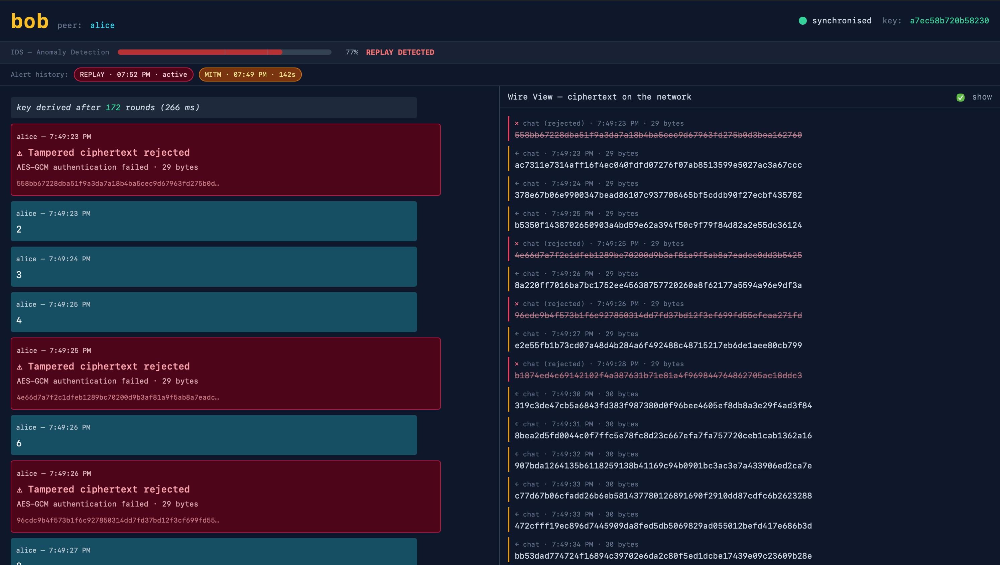
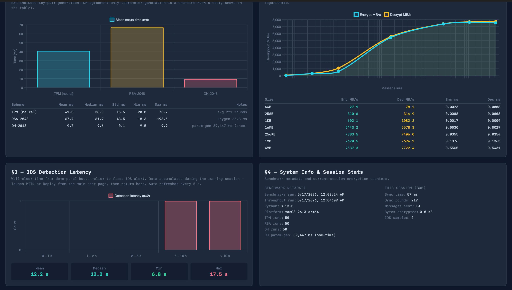

# AI-Enhanced Secure Communication System

A web-based secure messaging system combining neural cryptography with real-time AI intrusion detection.



*Live MITM attack detection — the IDS catches tampered ciphertext within seconds and surfaces a confidence-scored alert.*

## Overview

This project implements a secure two-party communication system where the cryptographic key is established without ever being transmitted, using mutually-learning neural networks instead of traditional algorithms like RSA or Diffie-Hellman. On top of this foundation, every encrypted message and file transfer is protected by AES-256-GCM authenticated encryption.

What makes the system distinctive is its third layer: an AI-based Intrusion Detection System (IDS) that watches encrypted traffic patterns in real time. Without decrypting anything, it learns to distinguish normal communication from active attacks like Man-in-the-Middle tampering and Replay injection, raising calibrated-confidence alerts when something looks wrong.

Built as a final-year academic project at RV College of Engineering, Bengaluru (Information Science, 2026). The neural cryptography component implements concepts from Ido Kanter and Wolfgang Kinzel's foundational 2002 work on Tree Parity Machines.

## Key Features

- **Neural key exchange** via Tree Parity Machines (K=3, N=10, L=3) — derives a 256-bit shared key over an insecure channel without ever transmitting it
- **AES-256-GCM authenticated encryption** for chat messages and file transfers, with chunked AEAD for large files
- **Real-time TCP communication** between two role-based processes (Alice and Bob) with length-prefixed framing
- **Polished web UI** with synchronized wire-view showing actual ciphertext flowing on the wire
- **Built-in attack simulators** for MITM (ciphertext tampering) and Replay attacks, scoped per-transport for clean training-data labeling
- **Random Forest IDS** trained on labeled feature windows, achieving 1.00 macro F1 on held-out test data
- **Live threat detection** with hysteresis-based alerting (fire at p>0.70, clear at p<0.50) to prevent UI flapping
- **Visual threat dashboard** — animated gauge, alert banner, history strip with confidence percentages
- **Performance metrics dashboard** comparing TPM, RSA-2048, and DH-2048 with quantitative benchmarks
- **178 unit and integration tests** spanning crypto primitives, network transport, attacks, IDS model, and end-to-end flows

## Technical Highlights

| Metric | Value |
|---|---|
| TPM key derivation | 41 ms mean (avg 221 sync rounds) |
| RSA-2048 setup | 67.7 ms mean |
| DH-2048 agreement | 9.7 ms (param-gen 39 s, one-time) |
| AES-GCM throughput | 7.6 GB/s peak (AES-NI accelerated) |
| IDS macro F1 | 1.00 on held-out test set (~1400 labeled samples) |
| IDS detection latency | 6-17 seconds depending on attack pattern |

.png)



*Performance metrics dashboard — quantitative benchmarks against RSA and Diffie-Hellman, AES-GCM throughput across message sizes, and live IDS detection-latency tracking.*

## Architecture

A four-layer design with clean separation between cryptographic primitives, network transport, application orchestration, and the user interface. Attack simulators and the IDS plug in as orthogonal modules without coupling to the core paths.

```
┌─────────────────────────────────────────────┐
│  Browser (Chat UI + Wire View + IDS Gauge)  │
└─────────────────────────────────────────────┘
                   ↕ SocketIO
┌─────────────────────────────────────────────┐
│  Flask + LiveIDS + PeerLink Orchestration   │
└─────────────────────────────────────────────┘
                   ↕ TCP
┌─────────────────────────────────────────────┐
│  TPM Sync • AES-GCM • Attack Hooks          │
└─────────────────────────────────────────────┘
```

See [`docs/ARCHITECTURE.md`](docs/ARCHITECTURE.md) for the full layered breakdown.

## Quick Start

```bash
git clone https://github.com/Kaizer-1/ai-secure-comm.git
cd ai-secure-comm
python -m venv .venv
source .venv/bin/activate   # On Windows: .venv\Scripts\activate
pip install -r requirements.txt
python launcher_dev.py
```

The launcher starts two role-based Flask processes (Alice on `:5001`, Bob on `:5002`) and opens both browser tabs automatically. Both peers auto-synchronize their TPMs, derive matching AES keys, and you can begin chatting securely.

For the full demo walkthrough with narration notes, see [`demo_final.md`](demo_final.md).

## Tech Stack

- **Language**: Python 3.13
- **Web framework**: Flask + Flask-SocketIO (threading async mode)
- **Cryptography**: `cryptography` library for AES-GCM, custom TPM implementation in NumPy
- **Machine learning**: scikit-learn (Random Forest classifier), pandas, joblib
- **Frontend**: Vanilla JavaScript, Tailwind CSS via CDN, Chart.js for the metrics dashboard
- **Testing**: Python `unittest`, Flask test client, Flask-SocketIO test client

## Project Structure

```
ai-secure-comm/
├── ai/                 # IDS module — feature extraction, training, live inference
├── attacks/            # MITM and Replay simulators with per-transport registry
├── benchmarks/         # Standalone performance benchmark scripts
├── core/               # Crypto engine, TPM, sync protocol, TCP transport, peer link
├── data/               # Training data (CSV) and data generation script
├── docs/               # Architecture, decisions, phase log, project state
├── static/             # CSS and JavaScript for the web UI
├── templates/          # Jinja2 templates (chat page, metrics dashboard)
├── tests/              # 178 unit and integration tests
├── app.py              # Main Flask + SocketIO application entry
├── config.py           # Centralized configuration (single source of truth)
├── demo_final.md       # Comprehensive demo guide with narration
├── launcher_dev.py     # Dev convenience — spawns both roles + opens browser tabs
├── network_check.py    # Pre-flight peer connectivity verification
└── requirements.txt
```

## Documentation

- [`docs/ARCHITECTURE.md`](docs/ARCHITECTURE.md) — System architecture and design patterns
- [`docs/DECISIONS.md`](docs/DECISIONS.md) — Technical decision log with rationale and alternatives considered
- [`docs/PHASE_LOG.md`](docs/PHASE_LOG.md) — Chronological development log
- [`docs/PROJECT_STATE.md`](docs/PROJECT_STATE.md) — Current project status
- [`docs/HANDOFF.md`](docs/HANDOFF.md) — Briefing document for continuing development
- [`demo_final.md`](demo_final.md) — Full demo script with narration notes and Q&A pointers

## Testing

```bash
python -m unittest discover tests
```

The suite covers cryptographic primitives, network transport with partial-read handling, attack simulator behavior, feature extraction, IDS state machine, threat alert event flow, end-to-end SocketIO integration, and benchmark structures. One test is documented as skipped (replay E2E timing is too slow for the test suite — verified manually in the live application).

## Future Work

- **Two-laptop deployment dry-run** over mobile hotspot — the architecture supports it via `BIND_HOST` and `PEER_HOST` config, but real-Wi-Fi conditions remain untested
- **Post-quantum key exchange comparison** — benchmarking against Kyber and other PQC primitives would strengthen the cryptographic-diversity argument
- **Adaptive IDS retraining** — continuously updating the Random Forest as new attack patterns are observed in deployment
- **Streaming AEAD** for very large file transfers (current implementation chunks but loads each chunk fully)
- **Persistent message history** across browser refreshes and reconnects
- **Per-receiver-perspective labeling** in the training data generator to eliminate the need for the current training-time filter

## License

MIT — see [LICENSE](LICENSE) for details.
